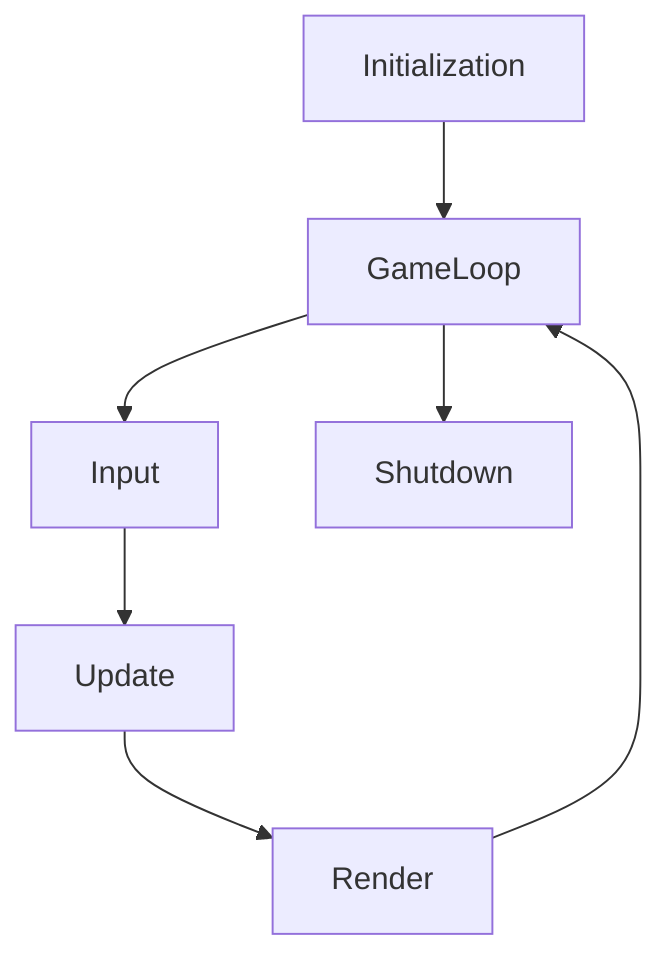

# Moteur de jeu

Cette partie se concentre sur le moteur, qui est relativement important pour comprendre comment peut fonctionner le jeu
en lui-même, bien que cette partie ne soit pas "demandée" par le projet en elle-même, le projet ne pourrait pas
fonctionner sans.

Tous les systèmes proposés dans cette partie ne sont pas spécifiquement développés pour Farmland et ne dépendent en aucun
cas du code de Farmland. Ce qui signifie qu'il serait très simple de réutiliser ce code pour développer un autre jeu
vidéo, voire modifier un peu le système de compilation pour le faire compiler dans son propre projet pour simplifier
cette usage.

## Le cœur

### La boucle de jeu

Comme la grande majorité des moteurs de jeu graphique en 2 ou 3 dimensions, le réel cœur qui fait
battre le moteur est la boucle de jeu (les autres systèmes pourraient être les organes vitaux pour simplifier), comme
le nom l'indique, cette partie correspond à du code qui est effectué en boucle tant que le jeu est en cours d'exécution.  
Cette boucle effectue 3 parties : *Input*, *Update*, *Render*.
- *Input* : Récupère toutes les informations en rapport avec les "entrées" (touche appuyé, clique effectué, fenêtre
  bougée, etc.).
- *Update* : Modifie l'état actuel du jeu (déplace un objet, effectue une action de gameplay, etc.).
- *Render* : Affiche l'état actuel du jeu à l'écran.

Bien sûr, il est important de noter qu'avant l'exécution de cette boucle, le jeu va d'abord s'initialiser. Et à la fin
de cette boucle (lorsqu'il est temps de quitter le jeu), il va se détruire.

Elle peut être visualisée comme ceci :  
PS: Ceci est un graph visible sur gitlab uniquement.  



Le nombre de fois que la boucle va être effectuée par seconde est défini comme ceci :
- En mode client : Elle va s'effectuer autant de fois possible par seconde.
- En mode serveur : Elle va s'effectuer 128 fois par seconde.

Une question importante apparaît alors, si la boucle s'effectue autant de fois que possible par seconde, comment
faire en sorte que des animations ou des actions physiques soient effectués de manière réaliste ? Bien sûr, il faut une
notion de temps pour ça, hors "autant que possible" ne donne aucune valeur de temps, le moteur introduit donc ce que
l'on appelle le *delta time* pour ça, cette valeur correspond à la durée qu'a mis la dernière itération de la boucle
à s'effectuer en seconde. Grâce à cette petite valeur, toute valeur multipliée par celle-ci se verras contrainte par le
temps, permettant donc des simulations physiques ou interpolations de valeur en temps réel.

### La sérialisation/désérialisation en pseudo-JSON

La sérialisation de Java est intéressante mais ne permet pas vraiment d'obtenir des données lisibles ou facilement
éditables, on a donc préféré utiliser un format plus compréhensible, que nous appelons du "pseudo-JSON". Nous avons
notre propre système et donc notre propre "langage" qui nous permet une flexibilité relativement intéressante, il est
grandement inspiré du JSON, d'où le nom, mais réalisé pour une meilleure interopérabilité avec le langage Java (support
des enum, des types primitif du langage, etc.).

Voici un exemple de pseudo-JSON :
```json
// This file contains the server configuration, feel free to edit what you need.

{
	"name": "My Server",
	"port": 8533,
	"capacity": 1,
	"mapSize": {
		"x": 16,
		"y": 16
	},
	"seed": 1621103479626,
	"numberOfBots": 0,
	"maximumLoanValue": 100,
	"debtRate": 3,
	"difficulty": com.ustudents.farmland.core.player.Bot$Difficulty::Normal,
	"password": "",
	"whitelist": [],
	"blacklist": [],
	"admin": []
}
```

Le JSON peux soit être écrit de manière beautifié (c'est-à-dire lisible, comme dans l'exemple ci-contre), soit minimifié,
c'est-à-dire sur une ligne uniquement sans espace ni fin de ligne (ce mode ne supporte donc pas les commentaires
uniligne).

### Les paramètres de démarrage

Beaucoup de programme propose des paramètres de démarrage, pour faciliter la personnalisation ou l'usage du programme.  
Le nôtre ne déroge pas à la règle. Nous possédons aussi notre propre système pour cela, qui permet de très facilement
définir un paramètre.

Voici un exemple de code permettant de créer une option :
```java
@Option(names = "--fast-bot", description = "Makes bot turns instantaneous.")
public boolean fastBot = false;
```

### La gestion d'évènement

Les évènements en programmation sont relativement importants, pour éviter de répéter des vérifications d'informations
très souvent, il est plus simple de se "raccrocher" à un évènement qui nous préviendra dès que les vérifications voulues
arrivent. Dans un jeu, c'est encore plus important, étant donné que les jeux sont des applications à haute-performance
par nature, il est important de ne pas gâcher le temps précieux que l'on possède à chaque itération de la boucle. D'où
l'intérêt des évènements pour minimiser ces vérifications.

Voici un exemple de code créant un évènement :
```java
EventDispatcher messageSent = new EventDispatcher();

public void sendMessage(String message) {
    System.out.println(message);
    messageSent.dispatch();
}
```

Et un exemple de code pour s'accrocher à un évènement :
```java
public void main(String[] args) {
    messageSent.add((dataType, data) -> System.out.println("Message envoyé"));
    
    sendMessage("test");
    
    // Devrait afficher:
    // test
    // Message envoyé
}
```

### Une sortie console plus avancée

Dans notre projet, nous n'appelons jamais la sortie console Java par défaut (exemple : `System.out.println("test")`),
nous appelerions `Out.println("test")` à la place. Car nous possédons une implémentation un peu plus avancée pour
faciliter le débogage. La nôtre supporte une partie des codes ANSI, pour afficher des couleurs dans les textes de la
console ainsi que du gras ou de l'italique (PS : Windows peut être capricieux avec ça).
Ensuite, tout ce qui est écrit est aussi envoyé vers un fichier de log qui sera enregistré sur le disque à la fin de
l'exécution du projet (dans `data/logs`). En l'état, les 8 derniers fichiers de log seront gardés. C'est relativement
utile pour retrouver une erreur qui s'est produite il y a quelques exécutions ou bien une autre information écrite.

### Des paramètres de jeu configurables

Les jeux étant souvent des applications configurables, notre moteur possède un système de paramètre pouvant être lu à
l'exécution du jeu, modifié durant son exécution et sauvegardé à la fin (sous forme de pseudo-JSON). Le moteur
possède ses propres paramètres, mais le jeu peut aussi fournir les siens.

## Le système de scène

### Le gestionnaire de scène

Le moteur dispose d'un gestionnaire de scène, qui permet de garder en mémoire la scène de jeu actuel et de transitionner
d'une scène à l'autre.

### Le système d'entité-composant-système

On pourrait imaginer que le contenu de chaque scène est la liste de ses **entités**, mais chacune de ses entités
possède un certains nombres d'information/de données, que l'on appelle des **composants**, et que ce qui permet
d'intéragir avec ces dites **entités** sont les systèmes qui vont rechercher les **entités** avec des **composants**
spécifiques.

C'est un pattern d'architecture logicielle très utilisé ces dernières années en jeu vidéo, car les moteurs de jeu
récents tendent à aller vers une architecture *donnée-orienté* plutôt qu’orienté objet. Alors nous avons décidé de
l'intégrer dans notre moteur, bien que compliqué à utilisé au départ, il permet finalement d'obtenir une hiérarchie plus
compréhensible. Ce pattern est privilégié en jeu vidéo car le *donne-orienté* consiste à structurer son code de manière
à obtenir un code qui fait un usage plus efficace du cache des processeurs, même si cela n'est pas vraiment faisable
en Java à cause du *garbage collector* alors ce n'est pas la raison pour laquelle nous l'avons programmé mais vraiment
plutôt pour son côté hiérarchique.

Un système peut être appelé aux moments *Update* et *Render*, ce qui lui permet d'intéragir avec le jeu.
Les entités ne peuvent pas intéragir avec *Update* et *Render*, mais les composants eux, le peuvent pour certains
(les composants en question doivent étendre des types spécifiques).

Les entités peuvent posséder un nom, des tags (exemple : "ennemis" pour définir que c'est un ennemi), un parent,
des enfants, être désactivé, avoir autant de composants que possible (mais elle ne peut pas avoir deux fois un
composant du même type, cela voudrait dire avoir deux fois les mêmes types de données).

### Intéraction entre les deux

Chaque scène possède un registre d'entité-composant-système. Donc une liste propre d'entités, de composants et de systèmes.

Mais il est possible de demander à conserver une entité donnée ou un système donné lors du changement de scène.
Utile pour conserver les choses voulues (exemple : une musique de fond entre toutes les scènes de menu).

## Le système audio

Ce système est codé sous forme de calque et peut donc être complètement désactivé (sans faire crasher le projet) à
l'aide d'un calque d'implémentation "vide", tandis que le calque fonctionnel utilise l'API OpenAL (inclus dans LWJGL).

### La lecture de fichier audio

À l'aide d'OpenAL, notre système audio est capable de lire des fichiers audio de plusieurs types, dont Ogg Vorbis (.ogg)
ou Waveform (.wav). Nous pouvons donc lire des fichiers de son/musique et les entendre en jeu. Cela correspond vraiment
au bas niveau de notre code.

Ensuite, nous avons des classes, comme `Sound` qui permettent d'intéragir avec un son chargé.

Finalement, *des composants* sont disponibles (bien plus haut niveau à utiliser) qui correspondent à des sons entre
autre.

## Le système graphique

Ce système est codé sous forme de calque et peut donc être complètement désactivé (sans faire crasher le projet) à
l'aide d'un calque d'implémentation "vide", tandis que le calque fonctionnel utilise l'API OpenGL/GLFW (inclus dans LWJGL).

### Gestionnaire de fenêtre

La gestion des fenêtres (création, destruction, etc.) est gérée par GLFW (inclus dans LWJGL), et permet de créer une
fenêtre sous de multiple plateformes sans accro. Des évènements sont déclenchés lors de différentes actions liées à la
fenêtre (déplacement, changement de taille, fermeture, etc.).

### L'affichage à l'écran

L'affichage à l'écran est permis à l'aide de notre système de rendu qui fonctionne avec OpenGL (inclus dans LWJGL).
Un contexte de rendu OpenGL est créé après l'ouverture de la fenêtre, et tout le code bas niveau permettant de rendre
quelque chose à l'écran est géré par le moteur, ce qui permet au programmeur de jeu de ne pas avoir à se soucier de
la complexité que cela peut poser. Cette partie correspond au code vraiment bas niveau du rendu.

Tout d'abord, pour afficher à l'écran il faut une **caméra**, nous avons donc une caméra qui calcule une projection
orthographique et s'occupe d'effectuer toutes les transformations matricielles nécessaires pour se déplacer, se pencher
et zoomer/dézoomer. Une fois cela défini, on utilise ce que l'on appelle un **spritebatch**, qui permet d'afficher à
l'écran différents types d'objets primitifs comme des textures ou des formes (cercle, point, rectangle, ligne).
Cela pourrait correspondre au second niveau de complexité du système de rendu.

L'affichage du jeu possède 3 **caméras** superposées (et par conséquent on peut simplifier en disant qu'il y a aussi 3
**spritebatch**) :
- La caméra du monde, qui correspond à la position du joueur et qui permet d'intéragir en coordonnée de monde
  (différent des coordonnées d'écran, un pixel n'a pas la même valeur qu'une unité du monde).
- La caméra de l'interface graphique, qui permet d'intéragir en coordonnée d'écran.
- La caméra du curseur personnalisé, qui est aussi en coordonnée d'écran mais est affiché au-dessus de tout.

Finalement, au-dessus de tout ça (plus haut niveau), il existe des **composants** qui peuvent être donnés à des entités
et qui définissent par exemple une image, un sprite (partie d'une image), une forme, un bouton, un sprite animé, etc.

La pièce qui s'occupe du rendu est en réalité deux *systèmes* (de l'ECS) qui sont appelés au moment *Render* de
chaque itération de la boucle de jeu :
- *WorldRenderSystem* : s'occupe d'afficher le monde (caméra et spritebatch du monde).
- *UiRenderSystem* : s'occupe d'afficher l'UI (caméra et spritebatch d'UI).

Le curseur lui est affiché en tout dernier et ne dépend pas de *système* étant donné que c'est un élément unique, pas
besoin de créer un système juste pour lui. Le jeu s'occupera de le rendre à la fin du *Render*.

### Les différents types d'élément affichables

Le moteur permet d'afficher les éléments suivants :
- Des formes (créées à partir d'une texture blanche de taille 1x1 créée en mémoire)
  - Un rectangle (soit entier, soit uniquement ses bordures)
  - Un cercle (ses bordures)
  - Un point
  - Une ligne
  
- Des textures
  - Une texture
  - Un sprite (une partie de texture)
  - Un 9-slicing sprite (une texture découpée en 9 morceaux, pour être redimensionnée (notamment les fonds de boutons))
  - Un sprite animé (notamment le curseur en jeu)
  
- Du texte (depuis une police d'écriture)

Un grand nombre de paramètres peut être appliqué pour modifier le rendu de chacun de ses éléments (taille, rotation,
couleur de teint, précédence d'affichage, etc.)

Un exemple de pseudo-JSON qui démontre la définition de plusieurs sprites à partir d'une image ainsi que de ses
animations :

<div align="center">
  
</div>

```json
{
    "path": "ui/map_cell_cursor.png",
    "sprites": {
        "1": {
            "x": 0,
            "y": 0,
            "z": 24,
            "w": 24
        },
        "2": {
            "x": 24,
            "y": 0,
            "z": 24,
            "w": 24
        },
        "3": {
            "x": 48,
            "y": 0,
            "z": 24,
            "w": 24
        }
    },
    "animations": {
        "default": {
            "loop": true,
            "frames": [
                {
                    "sprite": "1",
                    "duration": 0.14
                },
                {
                    "sprite": "2",
                    "duration": 0.14
                },
                {
                    "sprite": "3",
                    "duration": 0.14
                }
            ]
        }
    }
}
```

## Le système d'entrée

Ce système est codé sous forme de calque et peut donc être complètement désactivé (sans faire crasher le projet) à
l'aide d'un calque d'implémentation "vide", tandis que le calque fonctionnel utilise l'API GLFW (inclus dans LWJGL).

### Lecture des touches du clavier/de la souris

En utilisant la partie *Input* de la boucle de jeu, ce système est capable à chaque itération de la boucle de récupérer
les changements suivants :
- Lorsqu'un bouton de clavier/de souris est pressé
- Lorsqu'un bouton de clavier/de souris est relevé

Cela nous permet de pouvoir vérifier 4 états, si un bouton est levé, s'il vient d'être appuyé, s'il est maintenu et
finalement s'il vient d'être lâché, la vérification de ces 4 états permet donc un nombre varié de vérifications.

### Les actions et les mapping

Nous définissons une action comme quelque chose qu'un joueur peut réaliser ("avancer" par exemple).
Nous définissons un mapping comme une suite de conditions d'entrées à réaliser (appuyer sur E par exemple)

Mais une action est aussi composée d'une liste de mapping, et pour qu'une action puisse se réaliser, il faut que l'un
de ses mappings soit valide (que ses conditions soient vraies à une itération donnée de la boucle de jeu).

Ce système nous permet de définir des touches redéfinissables (rebindable).

## Le système de langue

### Fichiers de langue

Le système de langue est basé sur la lecture des différentes langues présentes dans le dossier `data/i18n` (i18n qui
signifie internationalisation).

Exemple de fichier de langue en pseudo-JSON :
```json
{
    "content": {
        "language": "Français",
        "singleplayer": "Solo",
        "multiplayer": "Multijoueur",
        "settings": "Paramètres",
        "credits": "Crédits",
        "quit": "Quitter",
        "version": "Version: {}"
    }
}
```

### Utilisation

Il est relativement simple à utiliser, le jeu possède une langue par défaut que l'on peut changer à tout moment
pour autant qu'il y a de fichiers de langues de trouvé.

Récupérer un texte est suffisamment simple :
```java
public void exemple() {
    System.out.println(Resources.getLocalizedText("language")); // Récupère le texte d'ID `language`
    System.out.println(Resources.getLocalizedText("version", "1.0.0")); // Récupère le texte d'ID `version` avec 1 paramètre.
}
```

## Le système d'interface graphique

### Les différents éléments disponibles

Ce système est encore suffisamment rudimentaire, la majorité des interfaces graphiques complexes étant affiché à l'aide
de la librairie ImGui, celle-ci permet de prototyper rapidement des interfaces complets sans avoir un système complexe
de notre côté.

Notre système dispose de 3 éléments (correspondant à des *composants*) :

- Un texte (utilisant une police d'écriture)
- Un bouton (le texte du bouton peut-être modifié à tout moment).
- Une fenêtre (une sorte de fond utilisé pour certains textes, comme sur l'indicateur de tour en partie, ou le menu de
  crédit).

Ces 3 éléments dispose d'un certain nombre de paramètres, qui permet de les positionner automatiquement ou de les
déplacer comme voulu lors du changement de taille de la fenêtre automatiquement (les paramètres utilisés sont des
`anchor` et `origin`).

### La création d'interface graphique

Il est assez redondant de créer soi-même les éléments d'interface car ils nécessitent beaucoup de code identique et
de créer une entité par élément composé souvent de plusieurs *composants*.

Pour régler ce soucis, nous avons créé le `GuiBuilder` qui s'occupe au début d'une scène de créer les éléments voulus
avec moins de code.

Exemple d'utilisation du `GuiBuilder`:
```java
// Création d'un bouton
public void exemple() {
    GuiBuilder guiBuilder = new GuiBuilder();

    GuiBuilder.ButtonData buttonData = new GuiBuilder.ButtonData("Cliquer ici", (dataType, data) -> {
        System.out.println("Le bouton a été cliqué !");
    });
    buttonData.position = new Vector2f(0, 0);
    
    guiBuilder.addButton(buttonData);
}
```

## Le système réseau

### Les contrôleurs

Le système réseau repose sur l'idée de contrôleur, le serveur en est un et chaque client en est un aussi.  
Le contrôleur est un élément capable d'envoyer des messages réseaux à l'aide du protocole TCP (nous avons choisi de ne
pas inclure la version UDP pour des questions de temps et de stabilité), il peut aussi en recevoir et par conséquent
il peut aussi envoyé des requêtes (envoyer un message, attendre la réponse).

Un contrôleur dispose de deux threads :
- Le thread de lecture des messages : lis les messages en attente de lecture.
- Le thread d'envoi des messages : envoie les messages en attente d'envoi.

### Fonctionnement du serveur

La spécifité du serveur en tant que contrôleur est tout d'abord son type de `Socket` étant donné que c'est un `Socket`
spécifique au serveur, il peut être créé sur un port donné. Il possède aussi la spécificité de pouvoir diffuser
des messages à l'ensemble de ses utilisateurs.

Un client qui lui envoie un message n'est pas son utilisateur pour autant, nous définissons l'utilisateur comme un client
qui aura demandé une connexion au serveur (un type de message qu'il peut envoyer), une fois connecté, le client
pourra demander des messages plus intéressants (l'état du jeu, etc.), s'il ne se connecte pas il ne peut envoyer que
des messages simples (est-ce que le serveur est en vie ; demande de connexion ; informations sur le serveur).

Le serveur dispose d'autres thread en plus de ceux du contrôleur :
- Thread d'interception client : attends de recevoir un message d'un client inconnu pour l'intercepter (récupérer ses
  informations pour être capable de lui envoyer un message).
- Thread de réception des messages par client : réceptionne les messages envoyés par un client spécifique et le transmet
  pour ensuite être lu par le thread de lecture des messages.  
  Chaque client connecté va créer un thread de ce type.
- Thread de la console : permet d'écrire des commandes dans le terminal pour intéragir avec le serveur.

### Fonctionnement du client

Le client lui possède donc un `Socket` de type client, il va donc s'attacher à un port disponible sur le réseau et
peut envoyer des messages à une adresse donné et un port donné. Lors de l'envoi à une adresse ou un port différent,
le client sera détruit pour en recréer un nouveau.

Il peut effectuer toutes les actions d'un contrôleur (envoyer un message, en recevoir, effectuer des requêtes).

Le client dispose du thread suivant en plus de ceux du contrôleur :
- Thread d'interception serveur : attends de recevoir un message du serveur et le transmet pour ensuite être lu par le
  thread de lecture des messages.

### Format d'un message

Les messages sont envoyés sous forme de pseudo-JSON minifié. Ce sont donc des objets Java sérialisés puis désérialisés.
Ils dépendent tous du type `Message` qui définit un message.

Exemple d'un message simple :
```json
{"_type":"com.ustudents.farmland.network.general.GameInformationsRequest"}
```
Ceci est un message qui envoie une requête d'informations sur la partie en cours au serveur. Le type
`GameInformationsRequest` étend donc `Message` et l'attribut *_type* est l'unique attribut de `Message` qui permet
de transmettre le type de Message, pour savoir le désérialiser. Ici le message ne possède aucun autre attribut.

Une réponse possible pourrait être :
```json
{"name":"My Server","capacity":1,"connectedPlayerIds":[0],"_type":"com.ustudents.farmland.network.general.GameInformationsResponse"}
```
Qui est un message de type `GameInformationsResponse` et qui possède les attributs `name`, `capacity` et
`connectedPlayerIds`.

Si un message dépasse la taille maximale d'un paquet autorisé par les `Socket`,

À l'aide du protocole TCP tout le reste est relativement automatique.  
Lors du développement en UDP, nous devions par exemple découper nous même les messages trop gros, ce qui augmentait
directement la complexité du système, nous devions aussi nous assurer nous même de l'envoi de certains paquets sous
faute de devoir les renvoyés.

### L'état du jeu

Si le jeu est lancé en mode serveur, le système audio, de rendu et d'entrée seront désactivés.

Tout le code du jeu (les scènes, etc.) seront joués de la même manière qu'en client, mais pour que le jeu puisse
s'adapter aux différents modes (solo, client ou serveur), il existe une énumération qui permet de vérifier cela et qui
est dans la classe `Game`, il suffit d'appeler la fonction `Game.get().getNetMode()`.

## Code utilitaire

Le moteur dispose aussi de code utilitaire pour différents domaines, avec par exemple les éléments ci-contre (mais ne
se limitant pas à ceux-ci) :
- Mathématique : Création d'une liste de points d'un cercle avec une précision et un rayon donné.
- Réflexion : Méthode d'aide à l'introspection de type Java.
- Génération de nombre : Un générateur de nombre aléatoire supportant les graines (basé sur celui de Java mais en plus
  dogmatique).
- Chaîne de caractères : Divers algorithmes utilisés pour lire/écrire des chaînes de caractères contenant des caractères
  d'échappement.
- ...

## Outils de développement

Le moteur dispose de quelques outils utiles au développement/débogage du jeu.  
Ils peuvent aussi permettre à des utilisateurs plus avancés d'intéragir plus aisément avec certaines parties du jeu.

### Le gestionnaire de jeu

Le premier outil de développement présent en jeu est le gestionnaire de jeu, il permet entre autre de voir la liste
des entités présentes dans la scène sous forme d'arbre (la hiérarchie parent-enfant dont la scène est la racine), la
liste des composants et leurs attributs (s'ils sont visibles).

Il permet ensuite d'avoir accès a un panel de paramètres permettant de modifier la synchronisation verticale (et dans
l'idée : encore d'autres paramètres).

Finalement, il permet aussi d'accéder à un compteur de performance.

Ce menu se lance par défaut avec F1.

### Le visualiseur de donnée

Le second disponible est le visualiseur de donnée, il permet uniquement de rendre visible certaines informations
(la taille des textes, un compteur de performance, le centre de l'écran).

Ce menu se lance par défaut avec F2.

### La console

L'un des plus intéressant est la console (ou REPL). Il permet de rentrer des commandes (avec ou sans argument) pour
intéragir avec le jeu. Le moteur possède ses propres commandes, mais le jeu peut aussi fournir les siennes. Chaque
commande possède une valeur d'autorité, c'est-à-dire que'elle permet de savoir dans quel mode de jeu (exemple : client
ou serveur) la commande sera utilisable. Toutes les commandes ne sont donc pas utilisable à chaque moment.

Ce menu se lance par défaut avec ².

# Farmland

## Informations générales

Le jeu est jouable de plusieurs manières :
- En solo avec ou sans robots.
- En multijoueur avec ou sans robots et avec ou sans autres joueurs.

## Les scènes du jeu

### Les menus

Le jeu est composé d'un certains nombres de scène de menus, qui étendent toutes de `MenuScene` pour simplifier le code.
La scène de démarrage du jeu est `MainMenu`.

### La scène de jeu

La scène principale est `InGameScene`, elle contient tout le code de gameplay lié au jeu.
Lorsque le joueur crée/rejoint une parti en solo, cette scène deviendra la scène active.
Lorsque le nombre de joueurs connecté au serveur est complet, cette scène deviendra la scène active.

Hiérarchie simplifiée des scènes :

- Scène de jeu
- Menu principal
  - Menu solo
    - Nouvelle partie
    - Chargement d'une partie
    - Supprimer partie
  - Multijoueur
    - Rejoindre un serveur
      - Rechercher un serveur
  - Paramètres
    - Changer les commandes
  - Crédits
  
Autres scènes :

- Scène de victoire/défaite

## Le gameplay

### Les règles du jeu

- Règle générale :
  - Un joueur gagne s'il dépasse 1 000 pièces d'or et ne possède aucune dette.
  - Un joueur perd s'il n'a plus du tout d'argent à la fin d'un tour.
  
- Règle spécifique aux parties en multijoueurs et/ou avec des robots.
  - Un joueur peut aussi gagner si c'est le seul survivant.

### Personnalisation de partie

Chaque partie possède les caractéristiques unique suivante :
- Un nom de sauvegarde.
- Une taille de carte (longueur et largeur).
- Une graîne (pour reproduire les positions de village généré).
- Un nombre de robots.
- La difficulté des robots.
- La somme maximale à emprunter.
- Le taux de remboursement de l'emprunt.

### Personnalisation du joueur

Chaque joueur possède les caractéristiques uniques suivantes :
- Un nom de joueur.
- Un nom de village.
- Une couleur de bannière (définira la couleur de son terrain).
- Un avatar coloré.
  - Couleur du pantalon à bretelle.
  - Couleur des boutons de bretelle.
  - Couleur de la chemise.
  - Couleur du chapeau.

### Système de tour par tour

Durant le tour du joueur, celui-ci a le choix entre plusieurs actions :
- Voir/acheter du terrain.
- Retourner au menu principal.
- Finir le tour actuel.
- Accéder à son inventaire.
- Accéder au marché de vente.
- Accéder à la carte des caravanes.
- Accéder au laboratoire de recherche.
- Accéder à la banque.
- Poser des ressources (en les sélectionnant dans son inventaire).
- Récolter des ressources prêtes.

Un tour dure 1 minute 30.  
Les récoltes/animaux grandissent à la fin d'un tour complet.

### L'inventaire

L'inventaire permet :
- D'afficher les objets qui ont été achetés ainsi que leur quantités.
- De sélectionner un objet pour pouvoir le poser sur le terrain ou de désélectionner l'objet actuellement sélectionné.

Chaque joueur possède son propre inventaire.

### Le marché de vente

Le marché est une structure permettant d'acheter ou de revendre des items, celui-ci est soumis aux lois de l'offre
et de la demande qui change constamment, notamment :
- L'achat a pour conséquence :
  - La baisse du prix des objets non achetés depuis plus de 2 tours.
  - L'augmentation du prix des objets achetés au dernier tour.
- La vente a pour conséquence :
  - L'augmentation du prix des objets non vendus depuis plus de 2 tours.
  - La baisse du prix des objets vendus au dernier tour.

Les prix du marché de vente sont communs entre tous les joueurs (ils influent donc les uns sur les autres).

### La carte des caravanes

Une caravane est un conteneur, pour un objet précis, avec une quantité supérieure à 2. L'envoi de caravane permet au
joueur d'obtenir une meilleure rentabilité que la revente au marché de vente, mais un temps d'attente sera nécessaire
pour le transport de la caravane et la réception des gains de la vente n'est donc pas immédiat.

La formule du calcul des gains est la suivante : `((Prix du marché + Avantage du niveau de recherches) x 1,5) x Quantité envoyée`

La carte des caravanes permet :
- D'envoyer des caravanes avec le fonctionnement suivant :  
  - Payer le coût initiale de 10 pièces d'or pour envoyer une caravane
  - Attendre l'arrivée de la caravane (4 tours) pour obtenir son gain.
- Visualiser l'état actuel de ses caravanes.
  
Chaque joueur possède sa propre liste de caravanes.

### Le laboratoire de recherche

Un système de recherche composé de deux recherches (fermier et éleveur) est disponible, il permet de payer un certain
nombre de pièces d'or afin d'améliorer ses compétences pour obtenir une meilleure rentabilité soit pour la vente de
récoltes (fermier) soit pour la vente de viande (éleveur). Chacune des recherches possède un niveau spécifique, plus
votre niveau est élevé, plus la rentabilité sera élevée. Bien sûr, le prix de chaque niveau augmente aussi.

Chaque joueur possède ses propres niveaux de recherche.

Il existe plusieurs paliers de décoration permettant au joueur de visualiser son niveau sur son avatar :

Palier | Niveau de recherche
--- | ---
0 | 1
1 | 3
2 | 5

### La banque

La banque permet :
- D'effectuer un prêt de manière à obtenir plus d'argent, qui sera obligatoire à rembourser pour gagner ou demander
  un autre prêt.
- De rembourser son prêt actuel, en donnant une somme précise.

Chaque joueur possède ses propres dettes.  
Si le joueur possède une dette impayée, une partie de celle-ci sera payé automatiquement à taux fixe à la fin du tour.

### Les robots (intelligence artificielle)

Les robots peuvent effectuer les actions suivantes lors de leur tour :
- Acheter du terrain
- Acheter des objets
- Vendre des objets
- Envoyer des caravanes
- Améliorer ses recherches
- Prendre un prêt

Il existe différents niveaux de difficulté qui change les actions que le robot est capable de réaliser et lui donne des
avantages sur le joueur.

Difficulté | Description
--- | ---
Facile | Achète un terrain ou un objet (de manière aléatoire) puis vend ce qu'il possède
Normal | Achète un terrain ou autant d'objets differents qu'il possède de terrains vides puis vend ce qu'il possède
Difficile | Achète un terrain ou autant d'objets identiques qu'il possède de terrains vides ou améliore ses recherches puis envoie des caravanes (s'il le peut) puis vend ce qu'il possède.
Impossible | Identique à **Difficile** mais à chaque tour s'il n'a pas de prêt alors il y a une chance sur deux qu'il en prenne un.

Le tour d'un robot dure 2 secondes par défaut.

### L'affichage tête haute (HUD)

Lors d'une partie, un HUD est présent pour afficher les informations suivantes :
- Votre avatar
- Les informations actuelles du tour (nombre de tours, nom du joueur qui joue).
- Un indicateur du temps restant à ce tour.
- Un indicateur du temps passé sur la partie entière.
- Un podium des joueurs.
- Le bouton du menu principal.
- Les boutons d'accès aux différents menus.

## Les paramètres modifiables

Il est possible de réinitialiser les paramètres.

### Général

- Activer/désactiver le son.
- Changer la langue.
- Changer le type d'affichage.

### Commandes

- Touches de déplacements.
- Touches de gameplay.
- Touches diverses.

Il est important de noter que les touches relatives à la souris ne peuvent pas être modifié. Ensuite, vous ne pouvez pas
utiliser des touches de la souris comme touche pour une action. Finalement, toutes les actions du jeu ne sont pas
modifiable (principalement l'action "pause" et les actions qui utilisent la touche Alt).

## Autres fonctionnalités notables

### Relatif au multijoueur

Si un serveur est en cours sur le réseau local, il sera automatiquement affiché dans la liste des serveurs en jeu.  
Mais il est aussi possible d'indiquer une adresse IP et un port pour se connecter à un serveur distant.

### Relatif aux paramètres de démarrage

La liste des paramètres de démarrage est la suivante :

Paramètre | Description
--- | ---
-h, --help | Affiche la liste des paramètres
-v, --version | Affiche la version du jeu
--debug | Affiche des informations de débogage
--vsync | Force la synchronisation verticale
--no-ansi | Désactive les codes ANSI (utile pour la compatibilité Windows)
--no-imgui | Désactive les interfaces ImGui (interface de développement)
--no-custom-cursor | Désactive les curseurs personnalisés
--no-window-icon | Désactive les icônes de fenêtre personnalisés
--no-sound | Désactive le système audio (pour du débogage ou le serveur uniquement)
--no-input | Désactive le système d'entrée (pour du débogage ou le serveur uniquement)
--no-render | Désactive le système de rendu (pour du débogage ou le serveur uniquement)
--no-save | Désactive l'enregistrement des fichiers de sauvegarde
--fast-bot | Rend le tour des robots immédiats
--fast-harvest | Rend la récupération des récoltes immédiates
--server | Lance le jeu en mode serveur dédié

### Relatifs aux commandes de la console

La liste des commandes de la console est la suivante :

Commande | Paramètres | Description
--- | --- | ---
help | | Affiche la liste des commandes
quit | | Quitte le jeu
clear | | Vide la console
say | text ... | Dis les mots données
pause | | Mets le jeu en pause
win | | Gagne la partie
win | name | Fais gagner le joueur au nom donné
kill | | Perd la partie
kill | name | Fais perdre le joueur donné
setMoney | quantity | Redéfinis votre argent à la somme donnée
setMoney | name quantity | Redéfinis l'argent du joueur voulu à la somme donnée

### Relatifs aux touches du jeu

La liste des touches par défaut est la suivante :

Combinaison | Description
--- | ---
F1 | Afficher le gestionnaire de jeu
F2 | Afficher le visualiseur de donnée
² | Afficher la console
Alt et BSG | Déplacer la caméra à l'aide de la souris
Ctrl | Afficher les territoires
Ctrl et BSG | Acheter le terrain à la position de la souris (si terrain proche du terrain possédé et que Alt n'est pas aussi pressé)
BSG | Poser un objet (si un objet est sélectionné et que Alt n'est pas pressé)
BSM | Activer/désactiver la sélection d'objet (si un objet est prêt et que Alt n'est pas pressé)
BSD | Récolter un objet
Z | Déplacer la caméra vers l'avant
S | Déplacer la caméra vers l'arrière
Q | Déplacer la caméra vers la gauche
D | Déplacer la caméra vers la droite
Scroll+ | Zoomer la caméra
Scroll- | Dézoomer la caméra
P ou Echap | Mettre en pause (durant une partie en solo)

#### Informations sur les touches

- BSG correspond à bouton souris gauche
- BSM correspond à bouton souris milieu
- BSD correspond à bouton souris droit
- AltG correspond à Alt gauche.
- AltD correspond à Alt droit.
- CtrlG correspond à Ctrl gauche.
- CtrlD correspond à Ctrl droit.
- Alt correspond à AltG ou AltD.
- Ctrl correspond à CtrlG ou CtrlD.

#### La moddabilité du jeu

Nous pouvons noter que le jeu est fait d'une manière qui le rend par nature relativement moddable. Bien sûr tout
d'abord tous les fichiers de données sont accessible, mais surtout, tous les objets (animaux, ressources) sont défini
dans les fichiers écrits en pseudo-JSON directement dans le dossier `data/items` et ils peuvent être modifié pour
rajouter des animaux ou ressources différentes mais il faudra aussi ajouter les textures correspondantes dans
`data/textures` et rajouter le support des langues dans `data/i18n`.

Il est aussi relativement facile d'ajouter des langues, il suffit de créer un nouveau fichier dans `data/i18n` et de
copier le contenu de `fr.json` ou `en.json` et le modifier pour la langue voulue. Le jeu devrait s'adapter automatiquement
en permettant de sélectionner la nouvelle langue dans les paramètres.

# Ce qu'on aurait aimé rajouter

- Un système de tutoriel.
- Un système de troupeau.
- Un système de sabotage.
- Un système de pari.
- Un interface graphique plus stylisé.
- Un système de whitelist/blacklist/administrateur et mot de passe pour le serveur.
- ...
