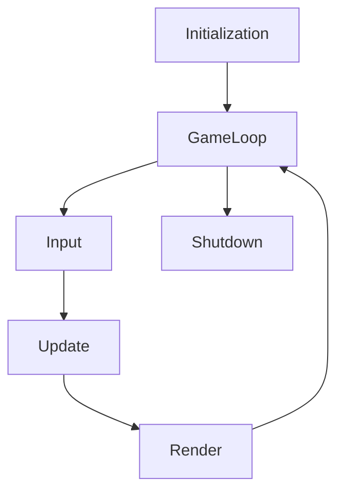

# Moteur de jeu

Cette partie se concentre sur le moteur, qui est relativement important pour comprendre comment peux fonctionner le jeu
en lui même, bien que cette partie ne soit pas "demandé" par le projet en elle-même, le projet ne pourrait pas
fonctionner sans.

## Le cœur

### La boucle de jeu

Comme l'extrêmement grande majorité des moteurs de jeu graphique en 2 ou 3 dimensions, le réel cœur qui fait
battre le moteur est la boucle de jeu (les autres sytèmes pourrait être les organes vitaux pour simplifier), comme
le nom l'indique, cette partie correspond à du code qui est effectué en boucle tant que le jeu est en cours d'exécution.  
Cette boucle effectue 3 partie: *Input*, *Update*, *Render*.
- *Input*: Récupère toutes les informations en rapport avec les "entrées" (touche appuyé, clique effectué, fenêtre
  bougé, etc.).
- *Update*: Modifie l'état actuel du jeu (déplace un objet, effectue une action de gameplay, etc.).
- *Render*: Affiche l'état actuel du jeu à l'écran.

Bien sûr, il est important de noter qu'avant l'exécution de cette boucle, le jeu va d'aborder s'initialiser. Et à la fin
de cette boucle (lorsqu'il est temps de quitter le jeu), il va se détruire.

Elle peut-être visualier comme ceci:

[comment]: <> (C'est un graphique utilisant la lib mermaid, fonctionne uniquement sur gitlab)


Le nombre de fois que la boucle va être effectuer par seconde est défini comme ceci:
- En mode client: Elle va s'effectuer autant de fois possible par seconde.
- En mode serveur: Elle va s'effectuer 128 fois par seconde.

Une question importante apparaît alors, si la boucle s'effectue autant de fois que possible par seconde, comment
faire en sorte que des animations ou des actions physique soit effectué de manière réaliste ? Bien sûr, il faut une
notion de temps pour ça, hors "autant que possible" ne donne aucune valeur de temps, le moteur introduit donc ce que
l'on appelle le *delta time* pour ça, cette valeur correspond à la durée qu'à mis la dernière itération de la boucle
à s'effectuer en seconde. Grâce à cette petite valeur, toute valeur multiplié par celle-ci se verras contrainte par le
temps, permettant donc des simulations physique ou interpolation de valeur en temps réel.

### La sérialisation/désérialisation en pseudo-JSON

La sérialisation de Java est intéressante mais ne permet pas vraiment d'obtenir des données lisible ou facilement
éditable, on a donc préféré utilisé un format plus compréhensible, que nous appelons du "pseudo-JSON". Nous avons
notre propre système et donc notre propre "langage" qui nous permet une flexibilité relativement intéressante, il est
grandement inspiré du JSON, d'où le nom, mais réalisé pour une meilleur interopérabilité avec le langage Java (support
des enum, des types primitif du langage, etc.).

Voici un exemple de pseudo-JSON:
```json
// This file contains the server configuration, feel free to edit what you need.

{
	"name": "My Server",
	"port": 8533,
	"capacity": 1,
	"mapSize": {
		"x": 16,
		"y": 16
	},
	"seed": 1621103479626,
	"numberOfBots": 0,
	"maximumLoanValue": 100,
	"debtRate": 3,
	"difficulty": com.ustudents.farmland.core.player.Bot$Difficulty::Normal,
	"password": "",
	"whitelist": [],
	"blacklist": [],
	"admin": []
}
```

### Les paramètres de démarrage

Beaucoup de programme propose des paramètres de démarrage, pour faciliter la personnalisation ou l'usage du programme.  
Le notre de déroge pas à la règle. Nous possédons aussi notre propre système pour cela, qui permet de très facilement
définir un paramètre.

Voici un exemple de code permettant de créer une option:
```java
@Option(names = "--fast-bot", description = "Makes bot turns instantaneous.")
public boolean fastBot = false;
```

La liste des paramètres de  démarrage de **farmland** est la suivante:

Paramètre | Description
--- | ---
-h, --help | Affiche la liste des paramètres
-v, --version | Affiche la version du jeu
--debug | Affiche des informations de débogage
--vsync | Force la synchronisation verticale
--no-ansi | Désactive les codes ANSI (utile pour la compatibilité Windows)
--no-imgui | Désactive les interfaces ImGui (interface de développement)
--no-custom-cursor | Désactive les curseurs personnalisés
--no-window-icon | Désactive les icônes de fenêtre personnalisés
--no-sound | Désactive le système audio (pour du débogage ou le serveur uniquement)
--no-input | Désactive le système d'entrée (pour du débogage ou le serveur uniquement)
--no-render | Désactive le système de rendu (pour du débogage ou le serveur uniquement)
--no-save | Désactive l'enregistrement des fichiers de sauvegarde
--fast-bot | Rend le tour des robots immédiats
--server | Lance le jeu en mode serveur dédié

### La gestion d'évènement

Les évènements en programmations sont relativement important, pour éviter de répéter des vérifications d'informations
très souvent, il est plus simple de se "raccrocher" à un évènement qui nous préviendra dès que les vérification voulu
arrive. Dans un jeu, c'est encore plus important, étant donné que les jeux sont des applications à haute-performance
par nature, il est important de ne pas gâcher le temps précieux que l'on possède à chaque itération de la boucle. D'où
l'intérêt des évènements pour minimiser ces vérifications.

Voici une exemple de code créant un évènement:
```java
EventDispatcher messageSent = new EventDispatcher();

public void sendMessage(String message) {
    System.out.println(message);
    messageSent.dispatch();
}
```

Et un exemple de code pour s'accrocher à un évènement:
```java
public void main(String[] args) {
    messageSent.add((dataType, data) -> System.out.println("Message envoyé"));
    
    sendMessage("test");
    
    // Devrait afficher:
    // test
    // Message envoyé
}
```

### Une sortie console plus avancé

Dans notre projet, nous n'appelons jamais la sortie console Java par défaut (exemple: `System.out.println("test")`),
nous appelerions `Out.println("test")` à la place. Car nous possédons une implémentations un peu plus avancé pour
faciliter le débogage. La notre supporte une partie des codes ANSI, pour afficher des couleurs dans les textes de la
console ainsi que du gras ou de l'italique (PS: Windows peux être capricieux avec ça).
Ensuite, tout ce qui est écris est aussi envoyé vers un fichier de log qui sera enregistré sur le disque à la fin de
l'exécution du projet (dans `data/logs`). En l'état, les 8 derniers fichiers de log seront gardé. C'est relativement
utile pour retrouver une erreur qui s'est produite il y a quelques exécutions ou autre information écrite.

### Des paramètres de jeu configurables

Les jeux étant souvent des applications configurable, notre moteur possède un système de paramètre pouvant être lu à
l'exécution du jeu, modifié durant son exécution et sauvegardé à la fin (sous forme de pseudo-JSON).

## Le système de scène

### Le gestionnaire de scène

Le moteur dispose d'un gestionnaire de scène, qui permet de garder en mémoire la scène de jeu actuel et de transitionner
d'une scène à l'autre.

### Le système d'entité-composant-système

On pourrait imaginer que le contenu de chaque scène est la liste de ses **entités**, mais chacune de ses entités
possède un certains nombres d'information/de données, que l'on appelle des **composants**, et que ce qui permet
d'intéragir avec ces dites **entités** sont les systèmes qui vont recherché les **entités** avec des **composants**
spécifique.

C'est un paterne d'architecture logicielle très utilisé ces dernières années en jeu vidéo, car les moteurs de jeu
récents tendent à aller vers une architecture *donnée-orienté* plutôt que orienté objet. Alors nous avons décidé de
l'intégrer dans notre moteur, bien que compliqué à utilisé au départ, il permet au final d'obtenir une hiérarchie plus
compréhensible. Ce paterne est privilégié en jeu vidéo car le *donne-orienté* consiste à structurer son code de manière
à obtenir un code qui fait un usage plus efficace du cache des processeurs, même si cela n'est pas vraiment faisable
en Java à cause du *garbage collector* alors ce n'est pas la raison pour laquelle nous l'avons programmé mais vraiment
plutôt pour son côté hiérarchique.

## Le système audio

Ce système est codé sous forme de calque et peux donc être complètement désactivé (sans faire crasher le projet) à
l'aide d'un calque d'implémentation "vide", tandit que le calque fonctionnel utilise l'API OpenAL (inclus dans LWJGL).

### La lecture de fichier audio

À l'aide d'OpenAL, notre système audio est capable de lire des fichiers audio de plusieurs types, dont Ogg Vorbis (.ogg)
ou Waveform (.wav). Nous pouvons donc lire des fichiers de son/musiques et les entendre en jeu.

## Le système graphique

Ce système est codé sous forme de calque et peux donc être complètement désactivé (sans faire crasher le projet) à
l'aide d'un calque d'implémentation "vide", tandit que le calque fonctionnel utilise l'API OpenGL/GLFW (inclus dans LWJGL).

### Gestionnaire de fenêtre

La gestion des fenêtres (création, destruction, etc.) est géré par GLFW (inclus dans LWJGL), et permet de créer une
fenêtre sous de multiple plateformes sans accros. Des évènements sont déclenchés lors de différentes actions liés à la
fenêtre (déplacement, changement de taille, fermeture, etc.).

### L'affichage à l'écran

L'affichage à l'écran est permis à l'aide de notre système de rendu qui fonctionne avec OpenGL (inclus dans LWJGL).
Un contexte de rendu OpenGL est créé après l'ouverture de la fenêtre, et tout le code bas niveau permettant de rendre
quelque chose à l'écran est géré par le moteur, ce qui permet au programmeur de jeu de ne peux avoir à se soucier de
la complexité que cela peux posséder. Cette partie correspond au code vraiment bas niveau du rendu.

Tout d'abord, pour afficher à l'écran il faut une **caméra**, nous avons donc une caméra qui calcule une projection
orthographique et s'occupe d'effectuer toutes les transformations matricielles nécessaire pour se déplacer, se pencher
et zoomer/dézoomer. Une fois cela défini, on utilise ce que l'on appelle un **spritebatch**, qui permet d'afficher à
l'écran différent type d'objets primitifs comme des textures ou des formes (cercle, point, rectangle, ligne).
Cela pourrait correspondre au second niveau de complexité du système de rendu.

L'affichage du jeu possède 3 **caméras** superposées (et par conséquent on peux simplifier en disant qu'il y a aussi 3
**spritebatch**):
- La caméra du monde, qui correspond à la position du joueur et qui permet d'intéragir en coordonnée de monde
  (différent des coordonnées d'écran, un pixel n'a pas la même valeur qu'une unité du monde).
- La caméra de l'interface graphique, qui permet d'intéragir en coordonnée d'écran.
- La caméra du curseur personnalisé, qui est aussi en coordonnée d'écran mais est affiché au dessus de tout.

Finalement, au dessus de tout ça (plus haut niveau), il existe des **composants** qui peuvent être donné à des entités
et qui définissent par exemple une image, un sprite (partie d'une image), une forme, un bouton, un sprite animé, etc.

### Les différents types d'élément affichable

Le moteur permet d'afficher les éléments suivant:
- Des formes (créé à partir d'une texture blanche de taille 1x1 créé en mémoire)
  - Un rectangle (soit entier, soit uniquement ses bordures)
  - Un cercle (ses bordures),
  - Un point
  - Une ligne
  
- Des textures
  - Une texture
  - Un sprite (une partie de texture)
  - Un 9-slicing sprite (une texture découpé en 9 morceaux, pour être redimensionné, les fond de boutons en sont par
    exemple)
  - Un sprite animé (le curseur en jeu par exemple)
  
- Du texte (depuis une police d'écriture)

Un grand nombre de paramètre peux être appliqué pour modifier le rendu de chacun de ses éléments (taille, rotation,
couleur de teint, précédence d'affichage, etc.)

Un exemple de pseudo-JSON qui démontre la définition de plusieurs sprite à partir d'une image ainsi que de ses
animations:

<div align="center">
  
</div>

```json
{
    "path": "ui/map_cell_cursor.png",
    "sprites": {
        "1": {
            "x": 0,
            "y": 0,
            "z": 24,
            "w": 24
        },
        "2": {
            "x": 24,
            "y": 0,
            "z": 24,
            "w": 24
        },
        "3": {
            "x": 48,
            "y": 0,
            "z": 24,
            "w": 24
        }
    },
    "animations": {
        "default": {
            "loop": true,
            "frames": [
                {
                    "sprite": "1",
                    "duration": 0.14
                },
                {
                    "sprite": "2",
                    "duration": 0.14
                },
                {
                    "sprite": "3",
                    "duration": 0.14
                }
            ]
        }
    }
}
```

## Le système d'entrée

Ce système est codé sous forme de calque et peux donc être complètement désactivé (sans faire crasher le projet) à
l'aide d'un calque d'implémentation "vide", tandit que le calque fonctionnel utilise l'API GLFW (inclus dans LWJGL).

### Lecture des touches du clavier/de la souris

En utilisant la partie *Input* de la boucle de jeu, ce système est capable à chaque itération de la boucle de récupérer
les changement suivant:
- Lorsqu'un bouton de clavier/de souris est pressé
- Lorsqu'un bouton de clavier/de souris est relevé

Cela nous permet de pouvoir vérifier 4 états, si un bouton est levé, s'il vient d'être appuyé, s'il est maintenu et
finalement s'il vient d'être lâché te permet donc un nombre varier de vérifications.

### Les actions et les mapping

Nous définissons une action comme quelque chose qu'un joueur peux réaliser ("avancer" par exemple).
Nous définissons un mapping comme une suite de conditions d'entrées à réaliser (appuyer sur E par exemple)

Mais une action est aussi composé d'une liste de mapping, et pour qu'une action puisse se réaliser, il faut que l'un
de ses mapping soit valide (que ses conditions soit vrai à une itération donné de la boucle de jeu).

Ce système nous permet de définir des touches redéfinissable (rebindable).

## Le système de langue

### Fichiers de langue

Le système de langue est basé sur la lecture des différentes langues présente dans le dossier `data/i18n` (i18n qui
signifie internationalisation).

Exemple de fichier de langue en pseudo-JSON:
```json
{
    "content": {
        "language": "Français",
        "singleplayer": "Solo",
        "multiplayer": "Multijoueur",
        "settings": "Paramètres",
        "credits": "Crédits",
        "quit": "Quitter",
        "version": "Version: {}"
    }
}
```

### Utilisation

Il est relativement simple à utiliser, le jeu possède une langue par défaut que l'on peux changer à tout moment
pour autant qu'il y a de fichier de langues de trouvé.

Récupérer un texte est suffisamment simple:
```java
public void exemple() {
    System.out.println(Resources.getLocalizedText("language")); // Récupère le texte d'ID `language`
    System.out.println(Resources.getLocalizedText("version", "1.0.0")); // Récupère le texte d'ID `version` avec 1 paramètre.
}
```

# FARMLAND

## Gameplay

### Actions du Joueur

#### Description

- Durant le tour du joueur ont a le choix entre plusieurs actions :
    - finir le tour : met fin au tour actuel
    - menu principal : retour au menu principal et sauvegarde la partie
    - inventaire : inventaire des graines et bébés animaux
    - marché : acheter des graines/bébés aniamux OU vendre les ressources qui ont pousser/atteint la maturité
    - caravanes : envoie des caravanes (limité a la moitié des ressources possedé) OU verifier l'avancé des caravanes
      envoyés
    - recherches : améliorer la recherche d'Eleveur (pour les animaux) ou de Fermier (pour les plantes) afin d'augmenter
      les gains des caravanes
    - banque :  prendre un prêt (limité a 1 prêt a la fois) OU rembourser une partie manuellement (remboursement d'une
      partie systematiquement a chaque tour)

#### Implémentation

### Inventaire

#### Description

#### Implémentation


### Marché

#### Description

#### Implémentation


### Système de robot (intelligence artificielle)

#### Description

- Les robots peuvent faire les mêmes actions que les joueurs c'est-à-dire : 
    - acheter un terrain, acheter des items, vendre son inventaire, envoyer des caravanes, améliorer les recherches et prendre des prêts
- leurs actions pendant les tours dependent de leurs difficultés :
    - facile : achete 1 terrain ou 1 item (de manière aléatoire) puis vend son inventaire
    - normal : achete 1 terrain ou autant d'items different que de terrains vide (si il y en existe) puis vend son inventaire
    - difficile : achete 1 terrain ou ameliore les recherches (de manière aléatoire) ou autant d'items identiques que de terrains vide (si il y en existe) puis envoie des caravanes (si il peut)  puis vend son inventaire
    - impossible : exactement les mêmes actions que la difficulté "difficile" mais à chaque tour si il n'a pas de prêt alors il y a 1 chance sur 2 qu'il en prenne 1


#### Implémentation

- amélioration des recherches : améliore la recherche qui benefie au premier item des terrains du bot


### Caravanes

#### Description

- Le systeme des caravanes consiste en :
    - envoyer la moitié de ses ressources en caravanes afin de gagner plus d'argent qu'au marché local
         - calcul des gains des caravanes : ( ( Prix du Marché locale + Avantage des Recherches ) x 1,5 ) x Quantité envoyé
    - payer 10 pieces pour le cout de la caravane
    - attendre 4 tours avant de récuperer les gains
        
#### Implémentation

- Chaque joueur contient une liste de leurs caravanes qui s'actualise a chaque tour complet 
    - une caravanes contient les gains, le nombre tours effectues, le nombre de tours avant d'arriver, le produit transporter

### Recherches

#### Description

- Le systeme de recherches consiste en :
    - une augmentation des gains obtenu via les caravanes 
    - un niveau refletant l'augmentation 
    - un prix pour augmenter de niveaux

#### Implémentation

- Chaque joueur contient une liste de leurs recherches initialiser a 2 recherches (Eleveur et Fermier) qu'ils peuvent ameliorer :
     - les recherches sont initialisé au niveau 1 avec un prix de 10 pieces pour l'amelioration et une augmentation de 0 piece
     - lorsque l'on augmente une recherche elle gagne 1 niveau, le prix pour la prochaine amelioration augmente de 10 pieces et l'augmentation qu'elle apporte aux caravanes augmente de 1 piece


### Banque

#### Description

#### Implémentation


### Bonus 

- Le cadre du joueur evolue avec l'avancé des recherches par palier (palier 0 : niveau 1 / palier 1 : niveau 3 / palier 2 : niveau 5)
- Le podium affiche les joueurs dans la partie dans l'ordre de leur argent (le classement est realise par un tri par insertion)
- Il y a un compteur de temps restant pour le tour (1 minute et 30 secondes) et aussi un temps total pour la durée de la partie

-------------------------

LISTE TODO TEMP (vérifier que )

FARMLAND:
- SCENES:
  - Menus (menu principal, crédits, ...)
  - Scène de jeu
- GAMEPLAY:
  - Possibilité de jouer en solo
  - Possibilité de jouer en multijoueur
  - Robots avec difficultés (facile, normal, difficile, impossible)
  - Personnaliser l'expérience (taille de carte, difficulté)
  - Personnaliser son personnage (nom, village, avatar, bannière)
  - Acheter du terrain
  - Poser/vendre des animaux/récoltes.
  - Caravanes
  - Recherches
  - Prêt/remboursement
  - Podium
  - Possibilité de gagner/perdre
  - OPTIONS:
  - Désactiver le son.
  - Redimensionner la fenêtre.
  - Changer le mode de rendu (fenêtré, fenêtré pleine écran, pleine écran).
  - Changer les touches de chaque action.
  - Changer la langue (anglais, français)


CE QU'ON AURAIT AIMER RAJOUTER:
- Tutoriel
- Troupeau
- Sabotage
- Pari
- Un interface graphique plus stylisé