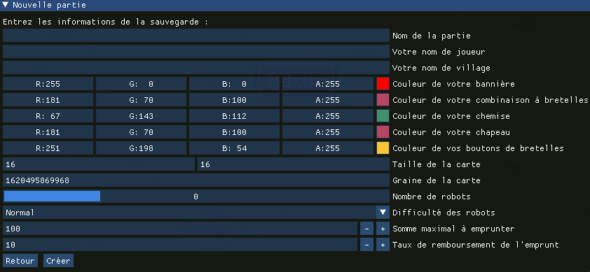
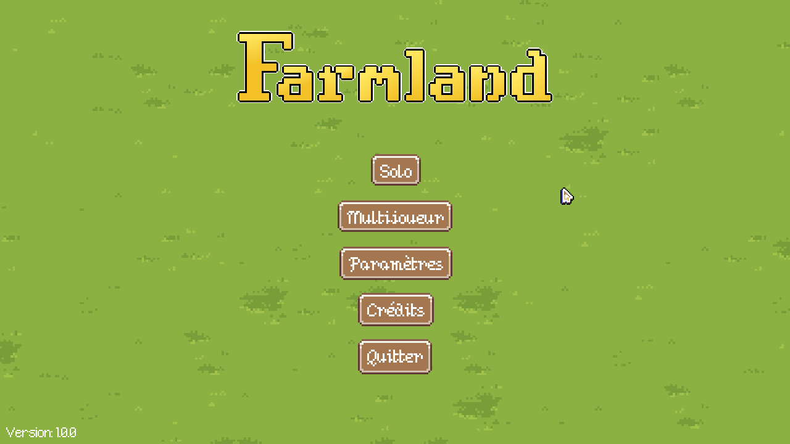
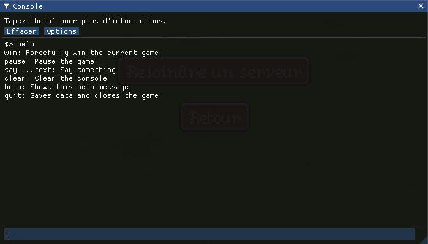
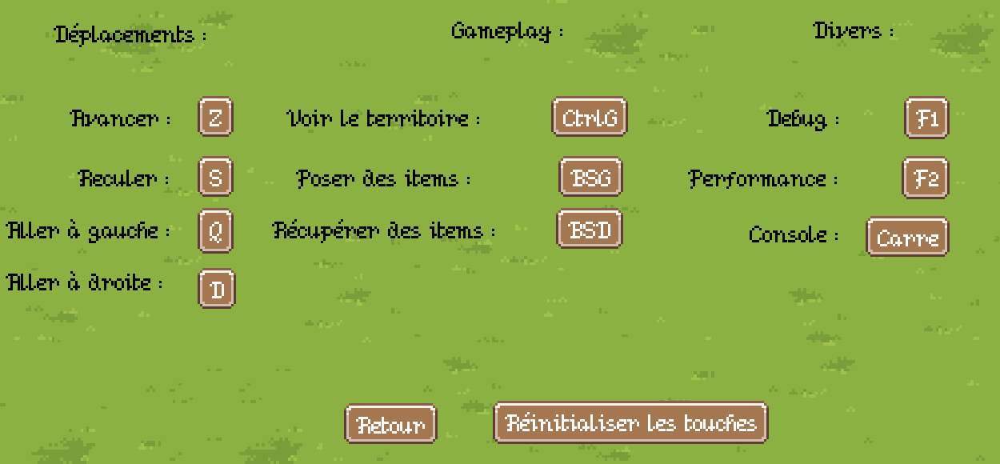
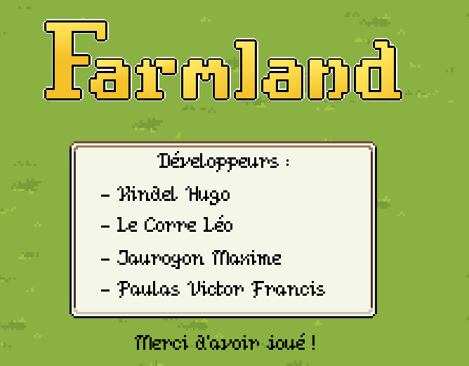

# Instructions de test des fonctionnalités principales

La majeure partie du projet devrait être relativement intuitive à utiliser, mais voici l'aide pour certaines
fonctionnalités primordiale du projet.

Beaucoup d'informations utiles (liste des touches, etc.) sont contenues vers la fin de [FEATURES](FEATURES.md), nous
vous conseillons de les observer en même temps que la lecture de ce guide en cas de soucis.

## I) Compiler et lancer le jeu

Les instructions pour compiler et lancer le jeu sont présentes dans le [README](README.md).

## II) Mode solo

### 1) Création d'une partie

<div align="center">
  
</div>

Lorsque vous arrivez pour la première fois dans le mode solo, vous devez obligatoirement créer une partie à l'aide du
menu que vous pouvez voir ci-dessus, afin de finir la création de la partie vous devrez fournir au moins le nom de la
partie, votre pseudo ainsi que le nom du village. Les autres champs vous permettront de modifier les informations en
question pour personnaliser votre expérience.

### 2) Jouer la partie

Une fois que la partie est créée et que vous êtes dans celle-ci, vous aurez de multiples options à votre disposition pour
remporter la partie :

- Utiliser le marché pour acheter ou vendres vos objets.
- Accéder à votre inventaire pour voir les objets que vous avez achetés et les sélectionner pour pouvoir les poser.
- Une fois qu'une de vos récoltes vous semblera mûre, vous n'aurez qu'à effectuer un clique droit dessus
  pour la récupérer, vous pourrez ensuite la vendre dans le marché ou à l'aide des caravanes.
- Envoyer des caravanes pour revendre des objets avec une meilleure rentabilité que le marché (mais un temps d'attente
  sera imposé).
- Améliorer vos recherches pour obtenir de meilleures rentabilités.
- Aller à la banque pour emprunter de l'argent pour ne pas vous ruiner ou rembourser une partie de votre précédent prêt.
- Finissez le tour actuel.
- Retourner au menu principal quand vous le souhaitez (vous pourrez rejoindre votre partie plus tard, elle sera
  automatiquement sauvegardée).
  
Pour prendre en main toutes ces options nous vous conseillons de faire votre première partie en solo et sans robot
puis une fois que vous avez compris comment toutes ces actions fonctionnaient, vous pourrez essayer de jouer en solo
avec des robots pour essayer de gagner.

La liste des touches est noté dans la catégorie « Relatifs aux touches du jeu » de [FEATURES](FEATURES.md).

<div align="center">
  
</div>

Une dernière chose, lorsque vous gagnerez ou perdrez, vous serez sur le menu des résultats, il y a deux boutons :
- « Rejouer » qui permet de recréer une partie avec les options que vous avez choisies dans la précédente partie
        et la même graîne (les terrains seront aux mêmes emplacements).
- « Menu Principal » qui vous permet de retourner au menu principal.

<div align="center">
  
</div>

### 2) Charger la partie
   
Lorsque vous voulez faire une pause et que vous quittez votre partie pour revenir plus tard, lorsque vous reviendrez
votre sauvegarde vous ramènera au tour où vous avez quitté le jeu que ce soit votre tour ou celui d'un autre joueur.
Vous retrouverez votre sauvegarde au moment exact où vous l'avez laissé.

### 3) Supprimer une sauvegarde
   
Le menu de suppression d'une partie est semblable au menu pour charger les parties, à la différence que cela supprime la
sauvegarde quand vous cliquez dessus. Il est intéressant de noter que les sauvegardes sont aussi automatiquement
supprimés, lorsqu'une partie est fini.

### 4) Quitter le jeu

Pour quitter le jeu proprement, pensez bien à fermer la fenêtre de jeu à l'aide de la croix ou d'utiliser le bouton
« Quitter » du jeu, si vous fermez le jeu automatiquement depuis votre IDE, votre débogueur ou en fermant la console
Gradle, les paramètres de jeu et les sauvegardes risqueraient de ne pas être sauvegardés.

### 5) Éditer les paramètres du jeu

Une fois le jeu quitté correctement, un fichier `data/settings.json` devrait avoir été créé contenant vos paramètres,
vous n'êtes pas censé l'éditer manuellement, mais vous pouvez tout de même jeter un coup d'oeil.

## III) Mode multijoueur

### 1) Lancer le serveur

La création d’une partie dans le mode multijoueur est différent du mode solo, vous devez d'abord lancer le jeu en mode
serveur dédié, pour cela, il suffit de le lancer avec la commande `--server`, si vous ne savez pas comment ajouter
un paramètre à gradle pour démarrer, voici la commande à utiliser :

```
./gradlew run --args="--server"
```

Le serveur devrait alors se lancer en attendant les joueurs.

La capacité par défaut en nombre de joueurs du serveur est de 2, vous devez donc lancer 2 autres instances normales du jeu
et aller dans le menu « Multijoueur » puis « Rejoindre un serveur » et votre serveur devrait s'afficher.
Vous devriez pouvoir le rejoindre, choisissez un joueur différent dans chacune des deux instances. Une fois les joueurs
créés, la partie devrait se lancer.

Vous devriez ensuite pouvoir jouer tout comme en solo.

### 2) Fermer le serveur

Pour fermer le serveur correctement, veuillez écrire `quit` dans le terminal du serveur.

### 3) Éditer la configuration serveur

Une fois le serveur quitté correctement, un fichier `data/server.json` devrait avoir été créé contenant la configuration
du serveur. Vous pouvez l'éditer pour changer les paramètres de jeu multijouer. Il devrait d'ailleurs contenir un
commentaire utile pour comprendre les différents paramètres.

## IV) Complémentaire

### 1) Utilisation de la console

À tout moment du jeu vous pouvez utiliser la console, qui s'ouvre par défaut avec ², elle vous permet de taper des
commandes comme `say bonjour` ou `setMoney "Robot 1" 1500`.

<div align="center">
  
</div>

La liste des commandes disponibles est noté dans la catégorie « Relatifs aux commandes de la console » de [FEATURES](FEATURES.md).  
Ou sinon, il vous suffit d'invoquer la commande `help` pour voir les commandes disponibles au moment ou vous utilisez la console.

### 2) Utiliser des paramètres de démarrage

Le lancement en mode serveur dédié n'est pas le seul paramètre de démarrage disponible. Pour une liste plus complète,
nous vous invitons à voir la catégorie « Relatif aux paramètres de démarrage » de [FEATURES](FEATURES.md).  
Il est aussi possible de lancer le jeu avec le paramètre `--help` ou `-h`.

### 3) Modification des paramètres

Le menu des paramètres accessible depuis le menu principal vous permet de modifier certains paramètres, le premier
permet d'activer/désactiver le son du jeu, ce que nous vous conseillons de faire, vous pouvez ensuite modifier le type
de rendu de la fenêtre, ainsi que la langue du jeu.

Un bouton **Commandes** permet également d'aller modifier les touches du jeu, celui-ci permet de voir les touches que vous
utilisez actuellement et d'en modifier, nous vous conseillons d'essayer de modifier les commandes avec
les touches du clavier telle que la commande « avancer ».

Il est important de noter que la souris n'est pas attribuable en l'état, que les actions qui relatent de la souris ne
sont pas modifiable, que certaines actions comme "pause" ne sont pas modifiable non plus et que des touches comme Alt
ne sont pas assignable pour éviter des soucis remarqué de compatibilité.

Également, vous avez un bouton « Réinitialiser les touches » qui vous permet de revenir à la configuration initiale.

<div align="center">
  
</div>

### 4) Voir les crédits

Le menu crédit est le dernier menu, celui-ci permet de conclure notre projet qui était de créer un jeu de gestion de
la manière la plus réaliste qu'il soit à notre niveau de connaissance actuel.

Nous tenions à vous remercier de nous avoir donné ce projet, il nous a tous beaucoup appris.

<div align="center">
  
</div>
