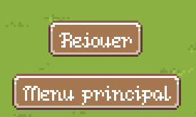
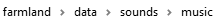

# Mode d'emploi du projet

## Mode Solo

**1) Création d'une partie :**

  
    
  Lorsque vous arrivez pour la première fois dans le mode solo,
  vous devez obligatoirement créer une partie à l'aide du menu
  que vous pouvez voir ci-dessus, afin de finir la création
  de la partie vous devrez fournir au moins le nom de la partie,
  votre pseudo ainsi que le nom du village.
  Les autres champs vous permettront :

  * Personnaliser l'apparence de votre avatar.
  * Définir les propriétés de la map.
  * Ajouter des bots avec une difficulté spécifique.
  * Définir les sommes et les taux de remboursement sur les emprunts.
    

**2) Jouer une partie :**
   
   Une fois que la partie est crée et que vous êtes dans celle-ci,
   vous aurez sept options à votre dispositions 
   pour remporter la partie :
    
   - Le marché qui permet d'acheter vos items ainsi que de les revendre, 
      celui-ci respecte les lois suivantes :
        * Achat d'item :
            * Baisse de prix sur les items non achetés au bout de 2 tours.
            * Augmentation des prix sur les items achetés à la fin du tour.

        * Vente d'item :
            * Augmentation des prix sur les items non vendus au bout de 2 tours.
            * Baisse des prix sur les items vendus à la fin du tour.
   
   - L'inventaire qui permet de stocker les items que l'on a achetés 
      dans le marché, dans celui-ci vous pourrez sélectionner les items 
      pour les poser sur terrain.

   - La caravane qui est utilisée pour augmenter la valeur des ressources 
     que l'on envoie et que l'on récupère quelque tour plus tard.

   - La recherche pour augmenter le rendement des animaux et des graines.

   - L'emprunt qui est utile pour acheter plus de terrain et de ressource.

   - Le bouton pour finir le tour.

   - Le bouton de retour sur le menu principal.

   Pour prendre en main toutes ces options nous vous conseillons 
   de faire votre première partie en «solo» (sans bot) puis une fois 
   que vous avez compris comment toutes ces actions fonctionnaient, 
   vous pourrez essayer de jouer en solo avec les bots pour essayer de gagner.
   Une dernière chose, Lorsque vous gagnerez ou perdrez vous serez 
   sur le menu des résultats, il y a deux boutons :

   -    «Rejouer» qui permet de recréer une partie avec les 
        options que vous avez choisi dans la précédente partie.
   -    «Menu Principal» dont vous pouvez lire la description 
        dans la section «1.4) Supprimer une partie :».

**3) Charger une partie :**
   
   Lorsque vous voulez faire une pause et que vous quittez votre partie 
   pour revenir plus tard, lorsque vous reviendrez votre sauvegarde 
   vous ramènera au tour où vous avez quitté le jeu que ce soit votre tour 
   ou celui d'un autre joueur. Vous retrouverez tous vos items 
   et améliorations choisies, ainsi que vos dettes 
   et les prix du marché avant que vous quittiez la partie.
   

**4) Supprimer une partie :**
   
   Le menu de suppression d'une partie est semblable au menu pour charger 
   les parties, à la différence que ça supprime la sauvegarde 
   quand vous cliquez dessus. Un autre moyen de supprimer 
   une partie existante est dans le menu «défaite» ou «victoire» 
   où vous devrez choisir de revenir au «menu principal» 
   pour supprimer votre partie.

                 
                 
              

   
## Mode multijoueur

**1) Créer et rejoindre une partie :**

   La création d’une partie dans le mode multijoueur est différent du mode solo,
   notamment vous devrez compiler et exécuter le programme sur deux terminaux 
   différents, le premier terminal servira au bon fonctionnement du serveur 
   dont vous verrez toutes les informations dans celui-ci, pour lancer 
   le serveur vous ferez la commande : “./gradlew run --args="--server" ”. 
   Le second servira pour jouer normalement, que vous lancerez 
   avec la commande : “./gradlew run”.
   Une fois que votre serveur et jeu sont lancés vous devrez 
   vous rendre dans le menu “Multijoueur->Rejoindre un serveur” puis choisir
   le bouton “mon serveur [0/2]” par défaut le serveur a déjà
   une configuration de partie, pour changer cela il faut couper 
   l'exécution de votre console en utilisant la commande “quit” dans 
   votre terminal où qui gère le server et quitter le jeu 
   sur votre terminal principal pour ainsi vous rendre dans le fichier 
   de configuration qui se nomme “server.json” dans le répertoire “data”.
   Une fois que vous avez modifié la configuration du serveur, 
   vous pouvez relancer de la même manière que précédemment 
   vos deux terminaux puis de nouveau vous rendre sur votre serveur 
   puis choisir un joueur et entrer les infos de celui-ci 
   et vous pourrez commencer à jouer.

**2) Spécificité d'une partie en multijoueur :**

   En ce qui concerne la partie, il est plus intéressant de tester 
   le serveur lorsque le nombre de joueur autorisé et d’au moins 
   deux car vous pourrez tester à l’aide d’un troisième terminal
   le multijoueur, celui-ci fera office de joueur deux.
   Nous vous conseillons de faire les meme test qu’en “solo” 
   et vous pouvez essayer de déconnecter un de vos compte de la partie 
   et passez un tour vous pourrez voir qu’un bot prendra votre place 
   le temps que vous reveniez.

**3) Utilisation de la console :**

   Enfin une nouveauté pour le multijoueur, la console qui permet 
   de faire ces actions :

   *    win : Pour que le joueur qui l’exécute gagne la partie.
   *    pause: Met le jeu en pause, équivalent à l’action de la touche “echap” lorsque le joueur à les droits 
        de le faire.
   *    say : Pour écrire un message avec le nom du joueur qui l’a écrit dans le chat.
   *    clear : Pour nettoyer le chat.
   *    help : Affiche les différentes commandes et leur description.
   *    quit : Pour quitter la partie.

## Paramètres

**1) Manipulation du son :**

   La première option du menu «paramètre» permet de désactiver/activer le son,
   les effets de ce bouton fonctionne sur tous les menus du jeu,
   nous vous conseillons de le désactiver par défaut 
   car celui-ci est assez fort, néanmoins si vous voulez le retrouver 
   celui-ci est dans le dossier :

                 
                     
                  
    

**2) Changement de langue :**
   
   Le changement de langue est un paramètre intéressant, 
   pour le moment, les seuls langages implémentés sont le français et l'anglais,
   que vous pourrez retrouver dans les fichiers de traduction via ce chemin :

                 
                     
                  
    

**3) Redimensionnement de la fenêtre :**
   
   Également nous avons inclus une fonctionnalité permettant de changer 
   la taille de la fenêtre du jeu, pour cela vous avez trois modes possibles :
   
   *    Fenêtré (ou «Windowed» en anglais).
   *    Pleine écran (ou «Fullscreen» en anglais).
   *    Pleine écran sans bordure (ou «Borderless» en anglais).

**4) Commandes :**
   
   Nous avons également ajouté un système de commandes, celui-ci permet de voir
   les touches que vous utilisez actuellement, de changer certaines commandes,
   nous vous conseillons d'essayer de modifier les commandes
   avec les touches du clavier telle que «avancer» (ou «goUp» en anglais),
   puis d'essayer de changer les boutons de la souris «poser un item»
   (ou «putItem» en anglais). 
   Mais faites attention certaines actions ne sont pas possible
   comme attribuer une touche du clavier pour les actions qui requiert
   un bouton de la souris et pareil inversement,
   vous ne pouvez pas choisir une touche qui est déjà attribuée et
   vous ne pourrez pas choisir n'importe quelle touche de votre clavier.
   Également, vous avez un bouton «Réinitialiser les touches» 
   (ou «reset mapping» en anglais) qui vous permet de revenir
   à la configuration initiale (que vous pouvez voir ci-dessous).

   

## Crédit

- Le menu crédit est le dernier menu, celui-ci permet de conclure notre projet qui était de créer un jeu de gestion de la manière la plus réaliste qu'il soit à notre niveau de connaissance actuel.

Nous tenions à vous remercier de nous avoir donné ce projet, il nous a tous beaucoup appris.

   