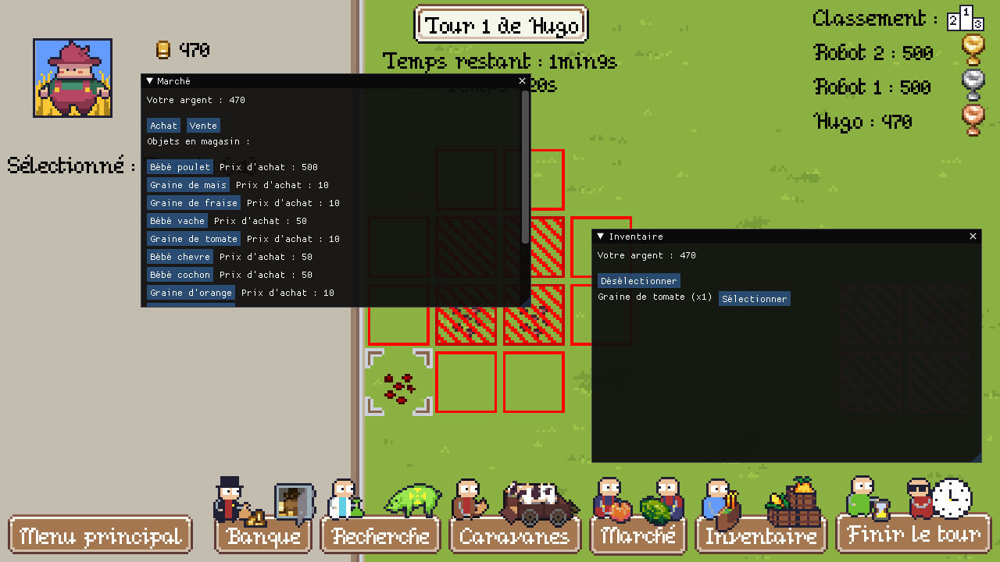
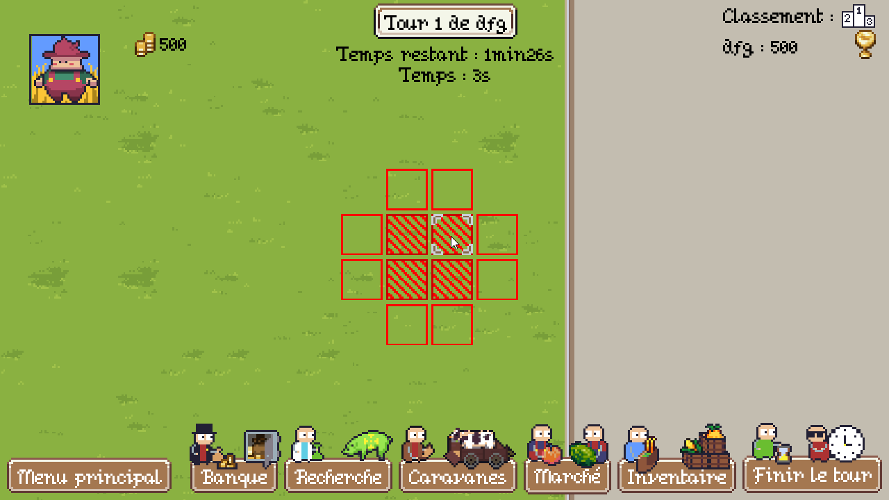

<div align="center">
  
</div>

# Farmland

Farmland is a management game where you need to take care of your farm while being careful about the economy to stay in business while your competitors will try to get on top of you!

## Screenshots

<div align="center">
    
    
    
</div>

## Features

- A homemade game engine.
- A turn by turn based farm management gameplay.
- A singleplayer and multiplayer experience.
- Useful debugging tools and console system.
- An easy to extend codebase (add an item, add a language, etc.).

To see more details about the features included and the project architecture, please take a look [here](FEATURES.md).

## Architecture

Tree of the most important files and folder in the project's repository hierarchy:

```
/
├─┬─src/: Source code.
│ ├─┬─main/java/com/ustudents/: Main source code package.
│ │ ├─┬─engine/: The engine source code
│ │ │ └─┬─audio/: The audio system code.
│ │ │   ├─core/: The core system code (resources, etc.).
│ │ │   ├─ecs/: The entity-component-system code.
│ │ │   ├─graphic/: The graphics system code.
│ │ │   ├─gui/: The GUI related code (GuiBuilder).
│ │ │   ├─i18n/: The language system code.
│ │ │   ├─input/: The input and input actions code.
│ │ │   ├─network/: The network system code.
│ │ │   ├─scene/: The scene code and scene manager.
│ │ │   ├─utility/: Some utility code.
│ │ │   ├─Game.java: Main engine class.
│ │ │   └─GameConfig.java: Configuration class.
│ │ └─┬─farmland/: The game source code
│ │   └─┬─component/: Evey game related ECS components.
│ │     ├─core/: Core game structures.
│ │     ├─network/: Every game related network messages.
│ │     ├─scene/: Every game scenes.
│ │     ├─Farmland.java: The main game class.
│ │     ├─Main.java: The class containing the main method.
│ │     └─*.java: Other source files.
│ └─test/: Tests source code.
├─┬─data/: Main data folder.
│ ├─fonts/: Fonts folder.
│ ├─i18n/: Localizations folder (english, french).
│ ├─items/: Resources databases.
│ ├─logs/: Generated log files.
│ ├─saves/: Generated save files.
│ ├─shaders/: Render system shaders code.
│ ├─sounds/: Sound and music files.
│ ├─textures/: Texture, sprite/sprite animation definition files.
│ ├─server.json: Generated server config file.
│ └─settings.json: Generated game config file.
├─FEATURES.md: A complete features list with explanations.
├─INSTRUCTIONS.md: Instructions to test the most important project's features.
├─README.md: This file.
├─ROADMAP.md: Roadmap of who did what and when.
└─*.*: Other files.

```

## How to use

### From sources

First, you need to clone the repository by using `git clone git@gaufre.informatique.univ-paris-diderot.fr:hugokindel/farmland.git` or `git clone https://gaufre.informatique.univ-paris-diderot.fr/hugokindel/farmland.git`

#### Compile with an IDE (if it supports Gradle):

1) Open the project's directory in your IDE.
2) Use the `run` gradle task.

#### Compile with the command line:

1) Open a terminal in your project directory.
2) Run gradle wrapper (it will download all dependencies, including gradle itself) `./gradlew build`.
3) You can finally run the project with `./gradlew run`.

### From a binary distribution

If you got a binary release (containing all the libs, assets and the bin directory), you can directly use `./farmland` (on UNIX systems) or `./farmland.bat` (on Windows).

## Try the project

Instructions to try every interesting features included within this project can be found [here](INSTRUCTIONS.md).

## Roadmap

The roadmap can be read [here](ROADMAP.md).

## Third party libraries

- [LWJGL](https://www.glfw.org/)  
  Gives access to other low level libraries (GLFW, OpenGL, OpenAL).
- [GLFW](https://www.lwjgl.org/)  
  Handles the window and the input.
- [OpenGL](https://www.opengl.org/)  
  Creates the rendering context, and a way to communicate with the GPU.
- [OpenAL](https://www.openal.org/)  
  Handles the audio system.
- [ImGui](https://github.com/ocornut/imgui) (with [imgui-java](https://github.com/SpaiR/imgui-java) as a binding)  
  Permits to rapidly develop usable GUI in a game.

## Contributors

- [LE CORRE Léo](https://gaufre.informatique.univ-paris-diderot.fr/lecorre)
- [KINDEL Hugo](https://gaufre.informatique.univ-paris-diderot.fr/hugokindel)
- [PAULAS VICTOR Francis](https://gaufre.informatique.univ-paris-diderot.fr/paulasvi)
- [JAUROYON Maxime](https://gaufre.informatique.univ-paris-diderot.fr/jauroyon)

## License

This project is made for educational purposes only and any part of it can be used freely.